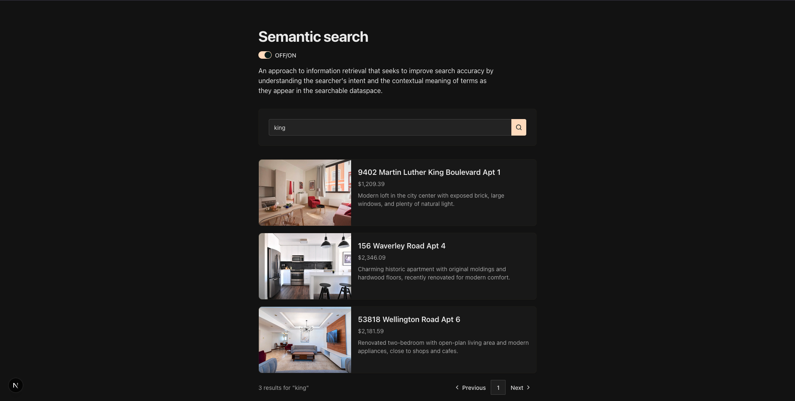

# Upstash Semantic Search

Demo application combining full-text search with vector semantic search over a PostgreSQL database. This app was created mainly as a tool to investigate possibilities of [Upstash Vector](https://upstash.com/docs/vector) and how to add it as a layer on top of SQL database in an existing project.



**Stack:** Next.js 16 · Drizzle ORM · Neon Postgres · Upstash Vector · nuqs

**Tested on:** Neon Postgres, Upstash Vector

**How it works:**

- Basic search uses PostgreSQL `to_tsvector` / `to_tsquery`.
- If full-text returns fewer results than the page size, the semantic fallback (toggle OFF/ON) fills remaining slots using vector embeddings from Upstash Vector.

Values for environmental variables can be found in service dashboards. To get them create account in particular service ([NeonDB](https://neon.com/) and [Upstash](https://upstash.com/)).

**IMPORTANT**
Before use, it is mandatory to create "Index" in Upstash Vector. Follow this "get started": [https://upstash.com/docs/vector/overall/getstarted](https://upstash.com/docs/vector/overall/getstarted)

## Getting Started

First, run the development server:

```bash
npm run dev
# or
yarn dev
# or
pnpm dev
# or
bun dev
```

Open [http://localhost:3000](http://localhost:3000) with your browser to see the result.

You can start editing the page by modifying `app/page.tsx`. The page auto-updates as you edit the file.

This project uses [`next/font`](https://nextjs.org/docs/app/building-your-application/optimizing/fonts) to automatically optimize and load [Geist](https://vercel.com/font), a new font family for Vercel.

## Learn More

To learn more about Next.js, take a look at the following resources:

- [Next.js Documentation](https://nextjs.org/docs) - learn about Next.js features and API.
- [Learn Next.js](https://nextjs.org/learn) - an interactive Next.js tutorial.

You can check out [the Next.js GitHub repository](https://github.com/vercel/next.js) - your feedback and contributions are welcome!

## Deploy on Vercel

The easiest way to deploy your Next.js app is to use the [Vercel Platform](https://vercel.com/new?utm_medium=default-template&filter=next.js&utm_source=create-next-app&utm_campaign=create-next-app-readme) from the creators of Next.js.

Check out our [Next.js deployment documentation](https://nextjs.org/docs/app/building-your-application/deploying) for more details.
